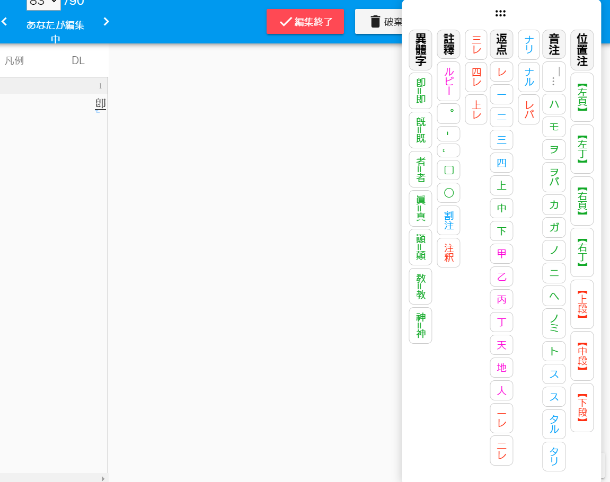
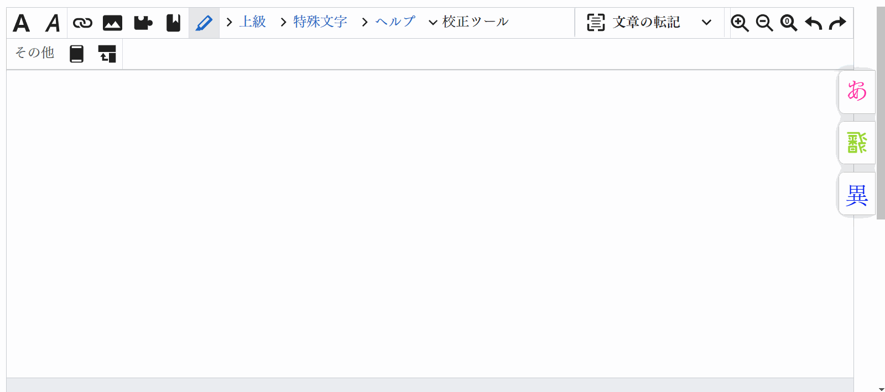
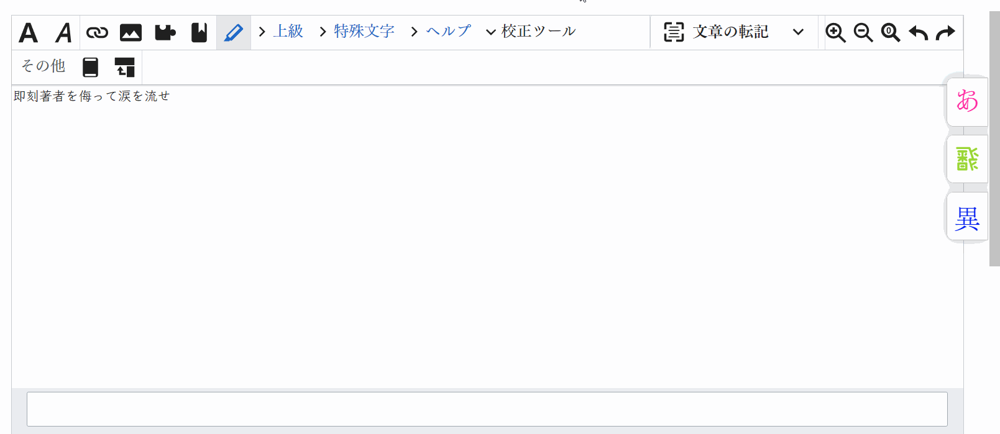

# 翻刻ツールボックス


日本の古典籍を翻刻する時によく利用する入力補助機能を集めたツールボックスです。



## サポートされているサイト

- [みんなで翻刻](https://honkoku.org/app/)
- [日本語版 Wikisource](https://ja.wikisource.org/)

## 機能概要

### 変体仮名



### 異体字



## 使い方

### インストール

[Tampermonkey](https://www.tampermonkey.net/)や[Greasemonkey](https://www.greasespot.net/)などの UserScript マネージャーをインストールした上、[Greasy Fork の URL](https://greasyfork.org/ja/scripts/512368-honkoku-toolbox/)からインストールするか、または[GitHub の Release から UserScript を入れて](https://github.com/mkpoli/honkoku-toolbox/releases/latest/download/honkoku-toolbox.user.js)ください。具体的な指示は各サイトのリンク先を参照してください。

### 開く方法

翻刻サイトのエディタを開くと右に「飜」のロゴ文字が表示されます。


自動的に表示されます。

### 機能一覧

- ドラッグ可能なフローティングメニュー
- 特殊文字の挿入・置換用ボタン
  - 一般
    - 踊字（々、ゝ、ゞ、ヽ、ヾ、〻、〳、〴、〵、〱、〲）
    - 合字（〆、 ͡と、ゟ、𬼂、𬻿、ヿ、𪜈、𬼀）
    - 濁点・半濁点（◌゙、◌゚）
    - 異体字（異体字セレクタ、CJK互換漢字）
      - 異体字のハイライト表示切り替え（「異體」のボタンを押すと新字がハイライト表示される）
      - 選択された異体字のボタンのハイライト（異体字が含まれる文字が選択された場合グループ及びボタンがハイライト表示される）
    - 変体仮名（五十音入力）
  - 「みんなで翻刻」
    - 頁註（【左頁】、【右頁】、【左丁】、【右丁】、【上段】、【中段】、【下段】、……）
    - 音註（￣ハ、￣モ、……）
    - 返点（＿レ、＿一、＿二、＿三、＿四、＿上、＿中、＿下、＿甲、＿乙、＿丙、＿丁、＿天、＿地、＿人、……）
    - 註釈（ルビー、割註、註釈）の括弧挿入
    - 句読点（。、！、？、……）・スペース（全角・半角）
    - その他（々、〆、◯、……）
  - ウィキソース
    - 傍点（﹅、﹆、•、◦、●、○、◉、◎、▲、△）
    - ルビー（`{{ruby|文字}}`）
    - 分註（`{{分註|文字|}}`）
    - 脚註（`<ref></ref>`）
  - カスタムボタン
    - ユーザー定義の入力文字と色を持つボタンの作成・編集・削除
    - カスタムボタンの設定の永続化（サイトに跨って保存されます）
  - ツールボックスの表示/非表示切り替え

## 開発

```bash
bun i
bun dev
```

### 機能追加

1. 機能を実装する。
2. 実践テストを行う。
3. ドキュメントを更新する。

### リリース

1. `bun run version`でバージョンを上げてタグコミットを作成しプッシュする。
2. GitHub Actions がビルドを行い、リリースページが自動的に作成されるのを待つ。
3. GreasyFork などの UserScript 共有サイトでリリースする。

## ライセンス

[MIT License](LICENSE) © 2023-2024 mkpoli
